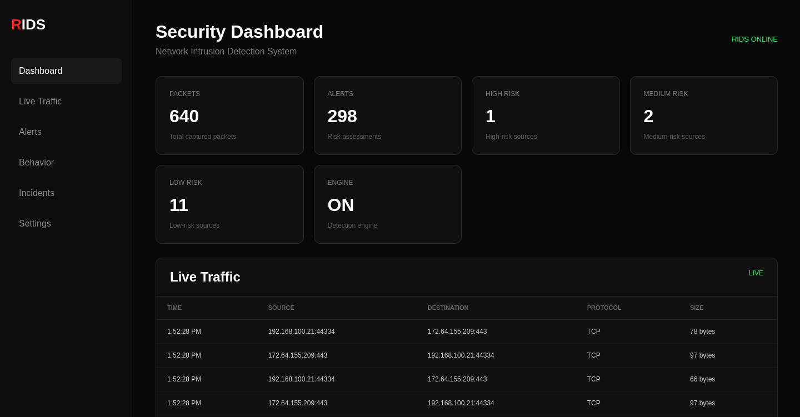

<p align="center">
  
</p>

<p align="center">
  A Python-based network intrusion detection system with behavioral analysis,
  event correlation, attack-chain detection, and simulated response execution.
</p>

---
# RIDS — Network Intrusion Detection & Response System

RIDS is a Python-based Network Intrusion Detection & Response System designed to detect suspicious network activity, analyze risk, correlate security events, identify attack chains, and generate simulated response actions.

## Features

- Network packet parsing and normalization
- SQLite-based packet and risk storage
- Rule-based intrusion detection
- Behavioral analysis
- Risk scoring
- Security alert generation
- Incident management
- Event correlation
- Attack-chain detection
- Automated response recommendations
- Response status tracking
- Simulated response execution
- Response execution history
- Flask REST API
- Real-time web dashboard

## Architecture

```text
Network Traffic
      |
      v
Packet Parser
      |
      v
Detection Engine
      |
      v
Risk Analysis
      |
      v
Alerts
      |
      v
Incident Management
      |
      v
Behavior Analysis
      |
      v
Event Correlation
      |
      v
Attack Chain Detection
      |
      v
Response Engine
      |
      v
Simulated Execution
      |
      v
Execution History
